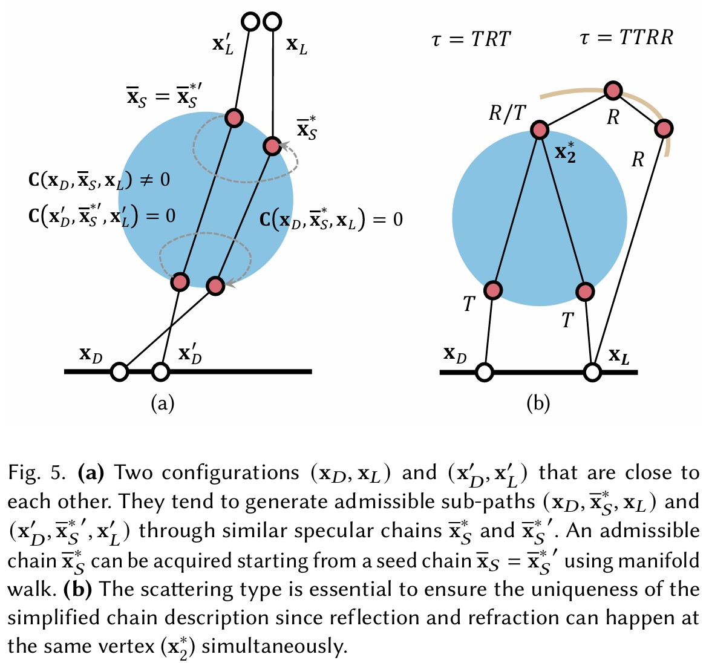
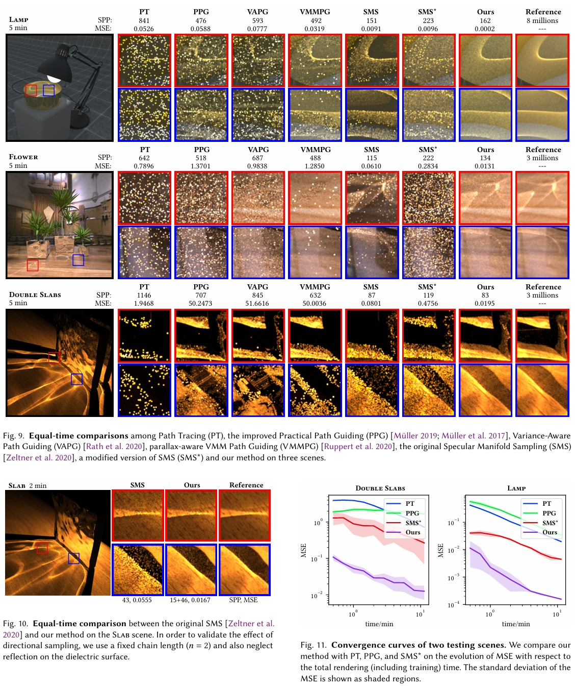

# Manifold Path Guiding for Importance Sampling Specular Chains  
**Zhimin Fan\*, Pengpei Hong\*, Jie Guo, Changqing Zou, Yanwen Guo, and Ling-Qi Yan**  
*ACM Transactions on Graphics (Proceedings of SIGGRAPH ASIA 2023)*  
[Paper] [Supplementary] [Code]  

---

## Abstract  
Complex visual effects such as caustics are often produced by light paths containing multiple consecutive specular vertices (dubbed **specular chains**), which pose a challenge to unbiased estimation in Monte Carlo rendering. In this work:  
- We analyze light transport behavior within sub-paths containing specular chains and non-specular separators.  
- We leverage **specular manifolds** to reconstruct continuous energy distributions from historical/coherent sub-paths.  
- We propose **manifold path guiding**, a progressive pipeline to importance sample paths with long specular chains via seed chain generation and manifold walks.  

Our method achieves **up to 40× variance reduction** compared to state-of-the-art unbiased methods, particularly in scenes with long specular chains and complex visibility.  


## The Challenge of Specular Chains  
Several common scenes still lack effective sampling strategies for handling light paths with **multiple consecutive specular/near-specular scattering events** (e.g., curved metals, water, glass). These paths cause severe convergence issues in physically-based rendering due to:  
- The difficulty of finding **valid path samples** that satisfy physical constraints at specular vertices.
- High dimensionality and discrete nature of admissible specular chain spaces.  

Limitations of Existing Approaches  
| Method             | Shortcomings                                      |  
|---------------------|--------------------------------------------------|  
| **MLT-based**       | Struggles with SDS paths despite specialized mutations. |  
| **Fitted Distributions** | Fail for pure specular cases (e.g., near point lights). |  
| **Specular Manifold Sampling (SMS)** | Performance degrades for long chains; ignores energy distributions. |  

## Our Solution: Manifold Path Guiding  
- Importance sample seed chains in a continuous space, then refine via **manifold walks** to converge to admissible chains.  
- Exploit coherence in specular manifolds for dimensionality reduction.  
- Use converged distributions for efficient sampling.  

## Key figures






## Citation  

```bibtex
@article{Fan23MPG,
  title     = {Manifold Path Guiding for Importance Sampling Specular Chains},
  author    = {Fan, Zhimin and Hong, Pengpei and Guo, Jie and Zou, Changqing and Guo, Yanwen and Yan, Ling-Qi},
  journal   = {ACM Trans. Graph.},
  volume    = {42},
  number    = {6},
  year      = {2023},
  month     = {Dec},
  issue_date= {December 2023},
  articleno = {257},
  numpages  = {14}
}